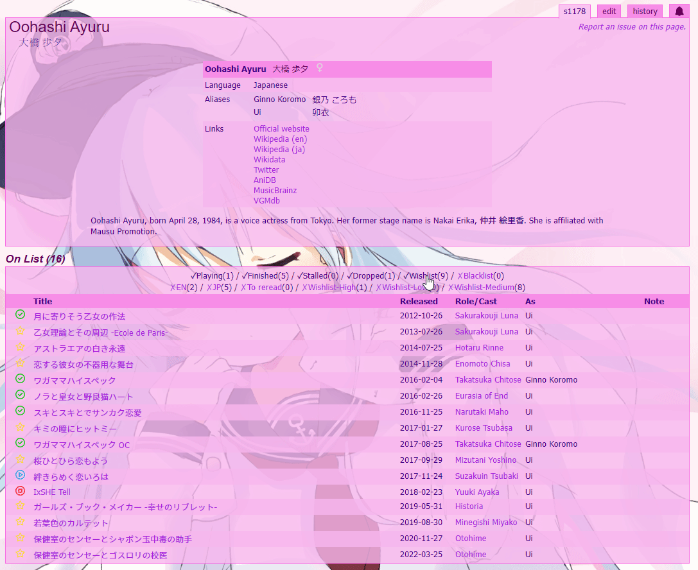
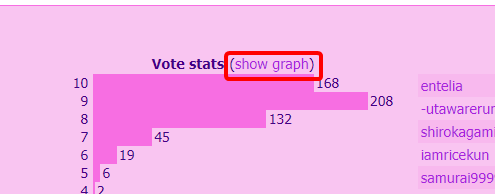
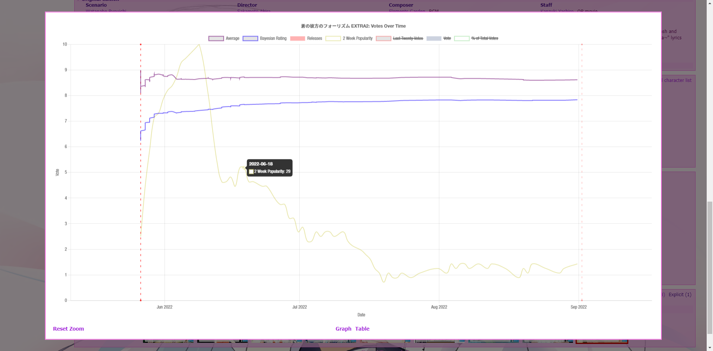
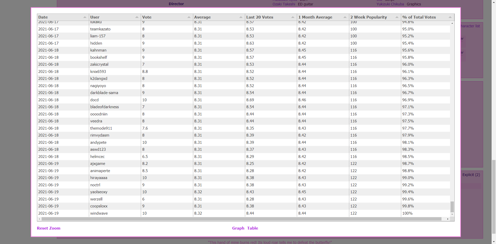
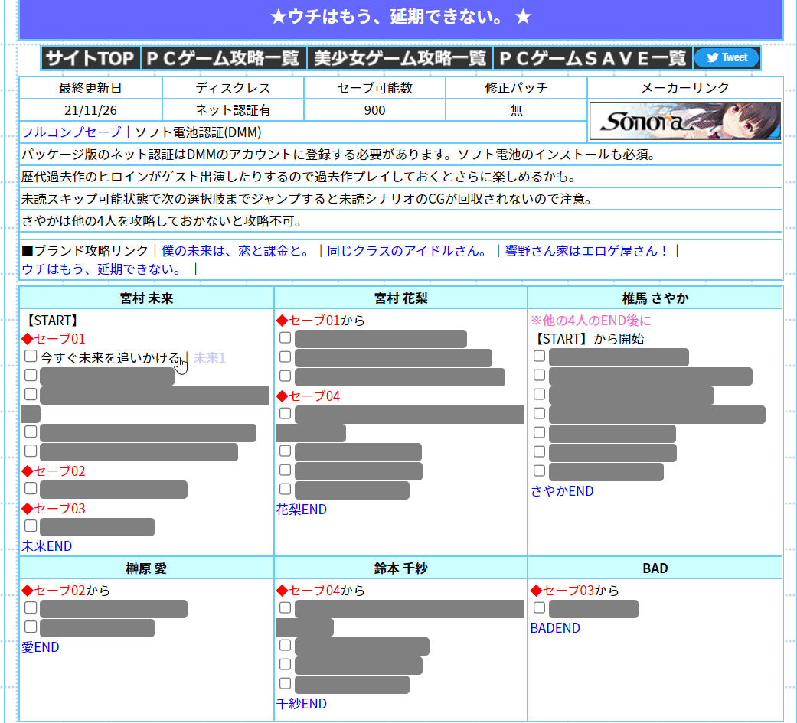

# VN(db) Userscripts <!-- omit in toc -->

I recommend using [Violentmonkey](https://violentmonkey.github.io/) to install userscripts.

- [vndb Links and Release Dates](#vndb-links-and-release-dates)
- [vndb At A Glance](#vndb-at-a-glance)
- [vndb Score History Graph](#vndb-score-history-graph)
  - [Usage](#usage)
- [vndb Localized Timezones](#vndb-localized-timezones)
- [Seiya Saiga Spoilers](#seiya-saiga-spoilers)

## vndb Links and Release Dates

**[Install](https://github.com/MarvNC/vn-userscripts/raw/master/vndb-official-stats.user.js)**

A userscript that adds official links and release dates to the main infobox on vndb entries.

## vndb At A Glance

**[Install](https://github.com/MarvNC/vn-userscripts/raw/master/vndb-at-a-glance.user.js)**

A userscript that adds a table at the top of staff and producer pages showing the VNs on your list at a glance, with toggleable options to show different list labels.

## vndb Score History Graph

**[Install](https://github.com/MarvNC/vn-userscripts/raw/master/vndb-score-graph.user.js)**

A userscript that adds score history graphs to pages on [vndb](http://vndb.org/).

### Usage

This script works on `vndb.org/v*` pages for visual novel entries, where you can click on a link next to the vote stats to display a graph of the score history. It isn't historically accurate because people can change their VNDB votes retroactively, and because the vndb weighted score algorithm changes over time based on overall database averages.

- Click on the legends at the top of the graph to toggle visibility of that dataset.
- You can zoom in the graph using the scroll wheel.
- Hit `ctrl+c` while focused on the table to copy its contents.

  
Reveal more images

## Seiya Saiga Spoilers

**[Install](https://github.com/MarvNC/vn-userscripts/raw/master/seiya-saiga-spoilers.user.js)**

A userscript that hides choices on seiya-saiga behind clickable spoiler bars until checked.

